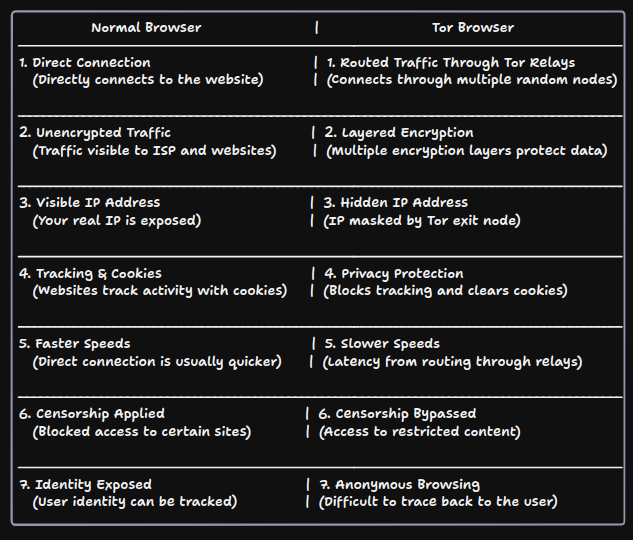

# 🌐 ft_onion - Web

## 🔒 A Tor Hidden Service

A **Tor hidden service**, also called a **Tor onion service**, is a website or online service that's accessible through the Tor network.

It helps keep both the server and the user's identity anonymous by routing traffic through multiple servers, making it harder to trace.

## 🛠️ How Tor Browser Works

[]

## 🌍 Normal Browser Vs 🧅 Tor Browser



## Getting Started

### Prerequisites

- **Docker** and **Tor Browser** must be installed on your machine.

### Build the Docker Image

1. Run the following command to build the Docker image:

   ```bash
   docker build -t tor-webserver .
   ```

2. Run the Docker Container

   ```bash
   docker run -d --name tor-webserver -p 80:80 -p 4242:4242 tor-webserver
   ```

### Use The Program

3. Access the Web Page
   Open your web browser. Go to

   ```bash
   http://localhost.
   ```

   You will see the static content from index.html.

4. Access the Server via SSH

   To SSH into the server without a password, use the command:

   ```bash
   ssh -p 4242 root@localhost
   ```

5. Accessing the Tor Service :
   Enter your Docker container using the following command:

   ```bash
   docker-compose exec  -it tor-webserver bash
   ```

   Once inside the container, run this command to retrieve the .onion address:

   ```bash
   cat /var/lib/tor/hidden_service/hostname
   ```

   Open the Tor Browser and enter the .onion address.

---

Feel free to explore and learn more about how Tor can help you stay anonymous online!
